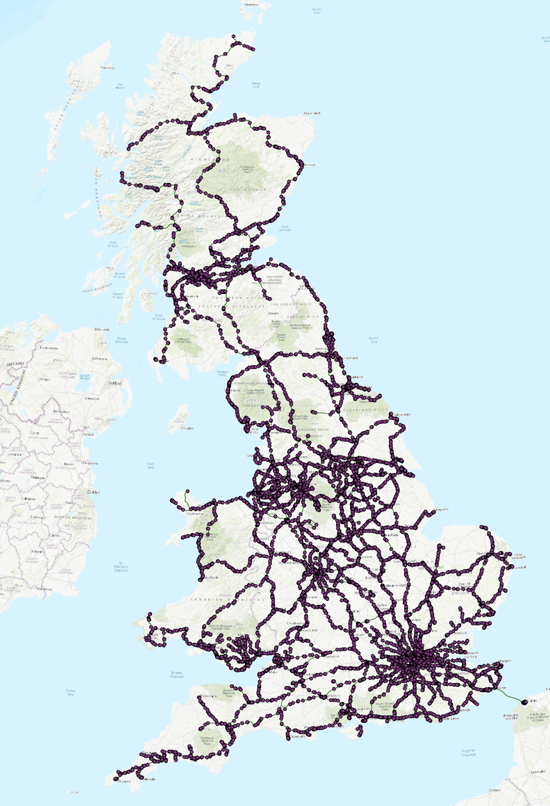
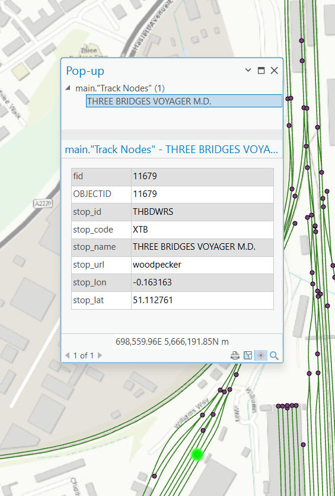
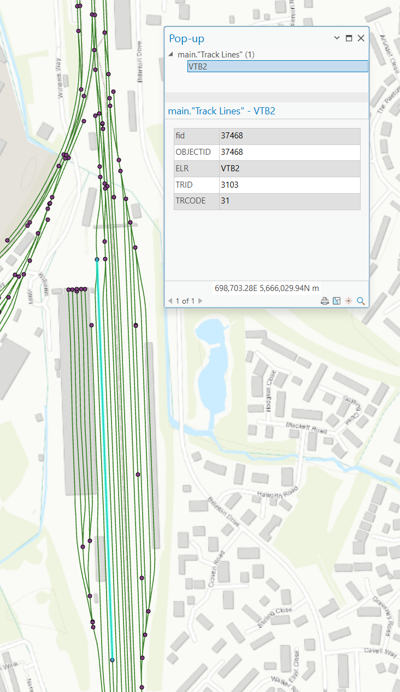

# Railway GIS data

This combines GIS data from various sources to create a good enough compilation of data for the UK rail network.

## Data sources

- [Yet Another TIPLOC list](https://github.com/oweno-tfwm/YA_Tiploc_List)
  - [DfT NAPTAN dataset](https://beta-naptan.dft.gov.uk/) - OGL3
  - [RDG Industry Data](https://data.atoc.org/rail-industry-data) - CC BY 2.0 UK
  - [Network Rail TPS, BPLAN and CORPUS Open Data](https://www.networkrail.co.uk/who-we-are/transparency-and-ethics/transparency/open-data-feeds/network-rail-infrastructure-limited-data-feeds-licence) - OGL3
  - [Woodpecker](https://github.com/anisotropi4/woodpecker/blob/main/LICENSE) - CC-BY-SA 4.0
  - [Rail Map](https://railmap.azurewebsites.net/Downloads) - CC-BY-SA 4.0
  - We have manually excluded the data from [UK2GTFS](https://github.com/ITSLeeds/UK2GTFS-data) due to its AGPL-3.0 license
- [Network Rail geospatial data, licensed under Open Government License](https://github.com/openraildata/network-rail-gis)

## Usage

Import the geopackage (`Tracks and Nodes.gpkg`) into your favourite GIS software, and start exploring!



## Contents

The geopackage file includes a copy of [Network Rail's VectorLinks and VectorNodes GIS data](https://github.com/openraildata/network-rail-gis), which represents the entire Network Rail (and more) managed rail infrastructure in the UK. It also includes the TIPLOC data from YATIPLOCL, which has had its nodes snapped to the Network Rail data.

`VectorNode`s are found at **every point** where two different track assets intersect. These can be used to create a graph of track assets, which can be used to calculate routes between points. It's important to make use of these `VectorNode`s rather than only using the polylines otherwise you may calculate routes that jump from a tunnel to a bridge where track passes over each other, for example.

Each `VectorNode` that comes from one of the TIPLOC data sources listed above contains associated metadata. Generated nodes created from intersecting track segments contain `null` values for these fields.

| Key         | Description                                                                                | Example                      |
| ----------- | ------------------------------------------------------------------------------------------ | ---------------------------- |
| `stop_id`   | The TIPLOC code associated with the node, or `null`                                        | `THBDWRS`                    |
| `stop_code` | The CRS code associated with the node, or `null`                                           | `XTB`                        |
| `stop_name` | The name of the location associated with the node from its original data source, or `null` | `THREE BRIDGES VOYAGER M.D.` |
| `stop_url`  | The data source for the metadata associated with the node, or `null`                       | `woodpecker`                 |
| `stop_lon`  | The longitude data for the node, or `null`                                                 | `-0.163163`                  |
| `stop_lat`  | The latitude data for the node, or `null`                                                  | `51.112761`                  |



In addition, each track segment retains some source metadata from the Network Rail track geometry data, including the engineering line reference and internal "track id".



### `networkGraph.json`

The entire network graph is stored in JSON format in `networkGraph.json`.

The file represents which VectorNodes are linked to which other VectorNodes and the ID of the line which connects them. The line ID can be used to look up the individual Lat/Lon points which make up the line, and its distance in centimetres.

An example pathfinding tool written in Go which makes use of this graph file is available in `./pathfinder`, which expects a hard-coded list of TIPLOCs to route between as a `testPath` variable. This will output a geojson file with the calculated path. Please note that paths are not always correct as they rely on the accuracy of snapped-to-rail-geometry TIPLOC data.

**Graph structure:**

```jsonc
{
  "nodesGraph": {
    "1": [
      {
        "nodeId": 52,
        "viaLineId": 16804
      },
      {
        "nodeId": 9778,
        "viaLineId": 1680
      }
      // ...
    ]
    // ...
  },
  "tiplocToNodeIds": {
    "KEYMERJ": 1
    // ...
  },
  "nodeMetadata": {
    "1": {
      "lon": -0.144,
      "lat": 50.924
    }
    // ...
  },
  "trackMetadata": {
    "16804": {
      "lengthCentimetres": 123456,
      "lineString": [
        {
          "lat": 50.924,
          "lon": -0.144
        }
        // ...
      ]
    }
    // ...
  }
}
```

## Changes

Thirteen `VectorNode`s have been removed from the dataset. These nodes were unconnected to any `VectorLine`s, and were likely remnants of previous tracks in the dataset which were removed.

**Removed IDs:** `4660, 9334, 14123, 14128, 18978, 18988, 18997, 23817, 28468, 33309, 33310, 38164, 38192`

## Considerations

- Multiple TIPLOCs may be mapped to the exact same position. This may be due to data limitations, or may be intentional. I actually just don't know. 🤷
- Newark Flat Crossing has `VectorNode`s for where the lines cross, but it's not possible for trains to move between the East Coast Main Line and the Nottingham &mdash; Lincoln line.
  - It may be decided to remove these nodes in the future to prevent inaccurate route calculations. Provided you use TIPLOCs as well, this shouldn't present issues.
- TIPLOCs may be snapped such that it is impossible to calculate a route from A to B, or doing so requires trains to use the wrong line.
  - Using the fake centre line data was initially explored, however the polylines do not always intersect cleanly in this data, presenting problems with calculating routes.
  - In the future, use of OpenStreetMap data instead may be preferred.

## Licensing

- OGL3 is [compatible with CC-BY 4.0](https://www.nationalarchives.gov.uk/doc/open-government-licence/version/3/#:~:text=These%20terms%20are%20compatible%20with%20the%20Creative%20Commons%20Attribution%20License%204.0)
- CC BY 2.0 UK is compatible with CC-BY 4.0.
- [License for Woodpecker's data is CC-BY-SA 4.0](https://github.com/anisotropi4/woodpecker/issues/4)
- The AGPL-3.0 data sourced from UK2GTFS has been excluded from YATIPLOCL.
