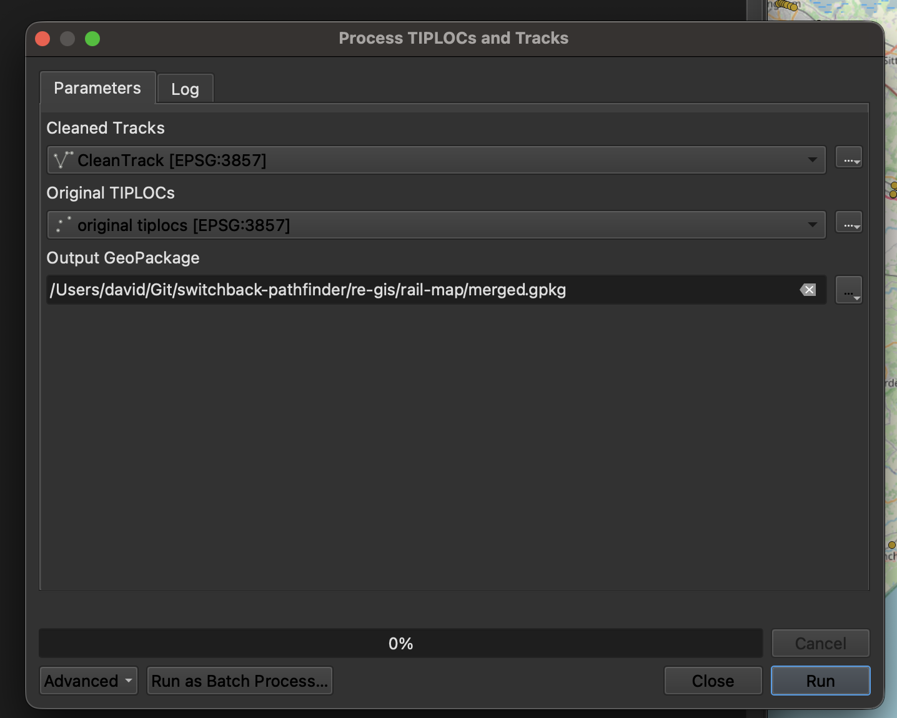

# Creating geospatial data

Included in this directory is a QGIS project file which will pull in the included geopackages and reference CSV file for TIPLOCs.

CleanedSimplifiedTracks.gpkg contains simplified railway track data useful for passenger-facing interfaces. Its polylines meet at junctions to allow for effective pathfinding.

SimplifiedTracks.gpkg represents the original engineering line refernce centreline geospatial data. Data is sourced from Network Rail's via the Rail Data Marketplace, licensed under OGL3. As areas of track are cleaned for use, they are added to CleanedSimplifiedTracks.gpkg, and removed from this geopackage.

TIPLOC data is sourced from [GB Railway Data Ltd](https://railmap.azurewebsites.net/Downloads) licensed under CC-BY-SA 4.0.

TIPLOC data is filtered to only relevant railway locations for train services, and then snapped to the simplified railway geometry.

## Runbook

This assumes you have QGIS 3, this repository and SAGA 9 configured.

### Updating TIPLOCs

TIPLOC data is originally sourced from the link above, however some TIPLOCs have been manually relocated or removed to allow for better routing across the rail network. Any updates to the source TIPLOC data should be implemented manually, adding only the new TIPLOCs required to the network so as to not affect existing implementations.

You can edit the existing TIPLOCs layer within QGIS, using the editing tools to move existing TIPLOCs or add new ones. Create TIPLOCs in an appropriate location, ensuring their nearest track is suitable for the TIPLOC. The automated data processing will automatically snap the TIPLOC to the nearest track during output generation.

### Updating track data

Updating track data is a more manual process, as it is infeasible to automatically update this from the source data. You should manually draw or amend track geometry directly in QGIS using the editing tools.

You can select a layer in the Layers panel, and then click the pencil icon to enter editing mode. You can then use the vector editing toolbar (View -> Toolbars -> Vector Toolbar) to add, move or delete vertices on the track geometry.

You should also enable snapping (View -> Toolbars -> Snapping Toolbar) to align track to existing lines' vertices to enable pathfinding tools to explore that area.

An example of editing track geometry can be seen in the video below. You can extend a line by hovering over its endpoint and clicking the plus icon, and then clicking to add new vertices. You can also move existing vertices by hovering over them and dragging them to a new location. You can create a new line with a separate 'add line feature' tool, and complete your new line using right click. In the dialog that appears, simply press "Ok" to complete the line.

<video src="./docs/edit-demo.mp4" controls></video>

### Exporting data for use in other tools

A prebuilt model is included within the QGIS project file which will automate the processing of the geospatial data into a Geopackage ready to be used by other tools.

You can run this model, "Process TIPLOCs and Tracks", from the "Project models" section within the "Processing Toolbox", and it will output a new geopackage file at the location specified with the merged dataset ready for use in automated systems.

Select the appropriate layers for each input, and specify the output path for the merged geopackage. This should ordinarily be committed to the repository for ease of use.

