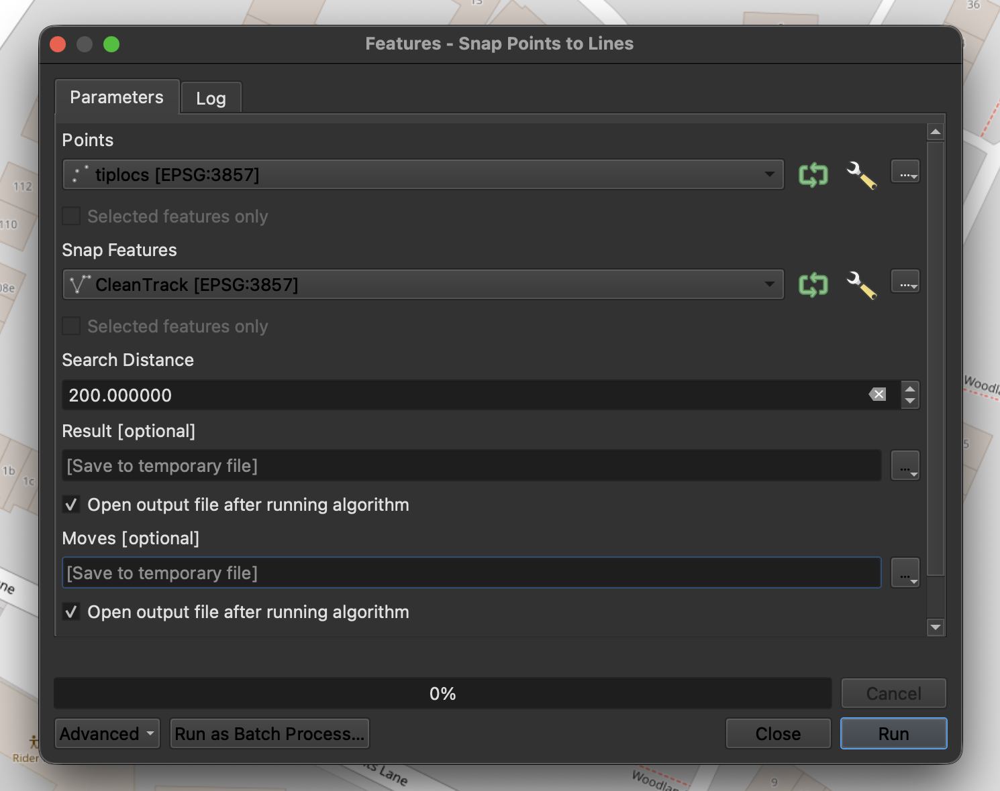
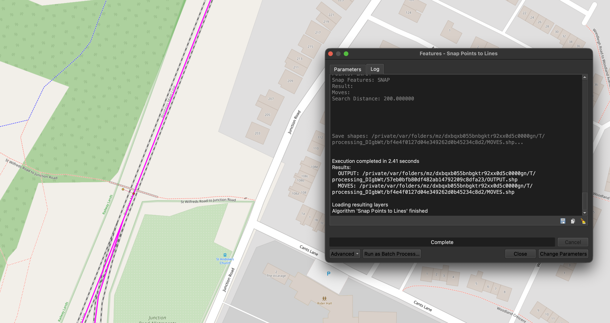
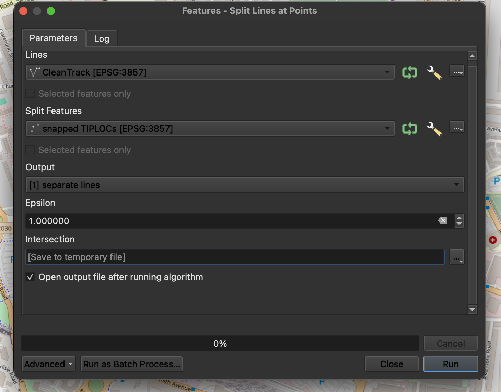
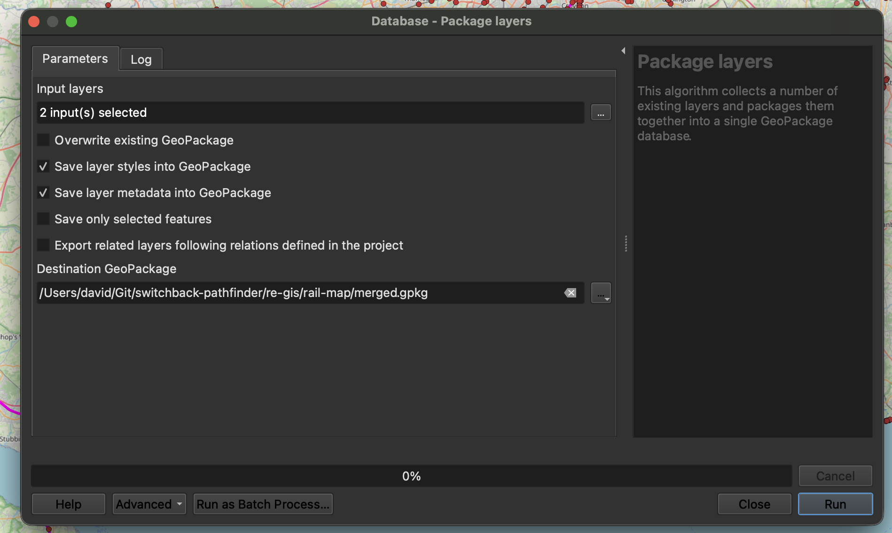
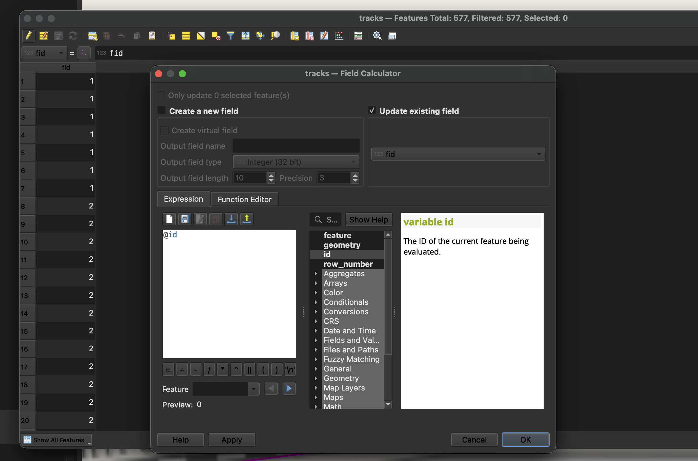

# Creating geospatial data

Included in this directory is a QGIS project file which will pull in the included geopackages and reference CSV file for TIPLOCs.

CleanedSimplifiedTracks.gpkg contains simplified railway track data useful for passenger-facing interfaces. Its polylines meet at junctions to allow for effective pathfinding.

SimplifiedTracks.gpkg represents the original engineering line refernce centreline geospatial data. Data is sourced from Network Rail's via the Rail Data Marketplace, licensed under OGL3. As areas of track are cleaned for use, they are added to CleanedSimplifiedTracks.gpkg, and removed from this geopackage.

TIPLOC data is sourced from [GB Railway Data Ltd](https://railmap.azurewebsites.net/Downloads) licensed under CC-BY-SA 4.0.

TIPLOC data is filtered to only relevant railway locations for train services, and then snapped to the simplified railway geometry.

## Runbook

This assumes you have QGIS 3, this repository and SAGA 9 configured.

### Updating TIPLOCs

You should download new TIPLOC reference data, filter it, refresh the data inside QGIS.

#### Automated data processing

A prebuild model is included within the QGIS project file which will automate the processing of the raw geospatial data into a Geopackage ready to be used by other tools.

You can run this model ("Process TIPLOCs and Tracks") from the Processing Toolbox, and it will output a new geopackage file with the filtered and snapped TIPLOCs.


#### Manual data processing

Run SAGA's Snap Points To Lines tool, with the following parameters:



TIPLOC nodes will be snapped to the nearest rail geometry within 200 metres. This will create a new layer with the snapped points as well as lines indicating their moves.



You should then run SAGA's Split Lines at Points tool, with the following parameters:



You can then export the snapped TIPLOCs and split lines to a new geopackage file using the Package layers tool.

Ensure the layers are named 'tiplocs' and 'tracks' respectively.



```
Feature creation error (OGR error: failed to execute insert : UNIQUE constraint failed: tracks.fid)
```

If you encounter errors relating to duplicate FIDs, you should open the affected layer's attribute table, then open the field calculator.

Use the calculator to update the fid column with the `@id` variable, which will assign a unique FID to each feature in the layer. Ensure you save your edits after this, and then re-run the Package layers tool.



### Updating track data

Updating track data is a more manual process, as it is infeasible to automatically update this from the source data. You should manually draw or amend track geometry directly in QGIS using the editing tools.

You can select a layer in the Layers panel, and then click the pencil icon to enter editing mode. You can then use the vector editing toolbar (View -> Toolbars -> Vector Toolbar) to add, move or delete vertices on the track geometry.

You should also enable snapping (View -> Toolbars -> Snapping Toolbar) to align track to existing lines' vertices to enable pathfinding tools to explore that area.

An example of editing track geometry can be seen in the video below. You can extend a line by hovering over its endpoint and clicking the plus icon, and then clicking to add new vertices. You can also move existing vertices by hovering over them and dragging them to a new location. You can create a new line with a separate 'add line feature' tool, and complete your new line using right click.

<video src="./docs/edit-demo.mp4" controls></video>

You must ensure that, wherever lines meet each other, their geometries are split. This is to ensure that pathfinding tools can explore the network effectively. You can use the Line intersections tool to create points where lines intersect, and then use the Split Lines at Points tool to split lines at those intersection points.

You should follow the steps above to update and snap TIPLOCs to the new track geometry, and then export the updated track geometry and TIPLOCs to a new geopackage file using the Package layers tool.
